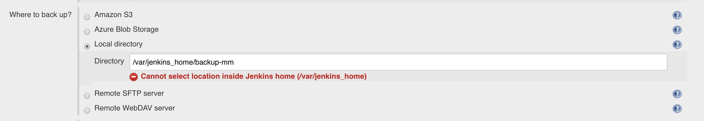
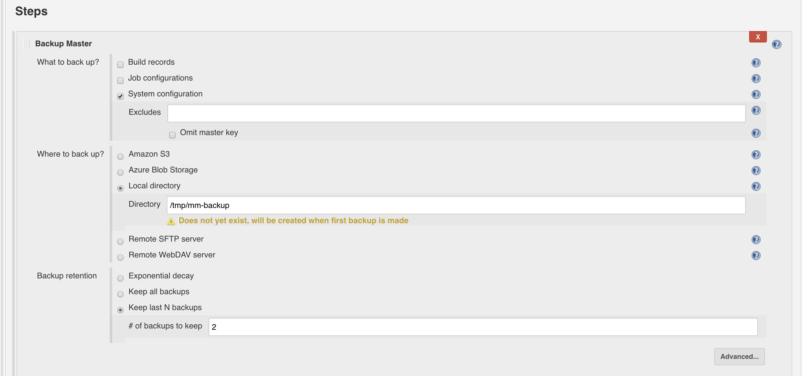
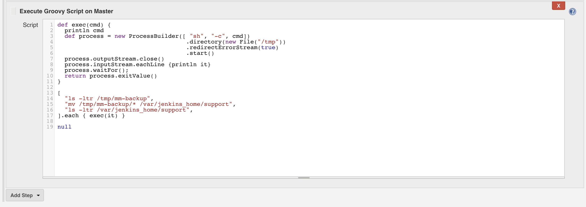

# How to backup CJE 1.x managed masters to local directory

The backup plugin simplifies the execution and the administration of backups. Backing up CloudBees Jenkins Enterprise is important for several reasons; for a disaster recovery such as a disk failure, for retrieving old configuration in case someone accidentally deleted something important, and for auditing for tracing back the origin of a particular configuration. Use **CJOC > New > Cluster Operations** job to perform a backup of connected Managed Masters.

## Local directory

This tells CloudBees Jenkins Enterprise to backup data as a file in the file system of the master. For disaster recovery purpose, it is recommended that you back up files to a network mounted disk. While the Cluster Operations Backup job is running on the CJOC, the backup tarballs are created inside each managed master, i.e. local file system.

### Managed Master container 

Managed Masters are docker containers. `$JENKINS_HOME` folder is usually the only folder where files can be stored.
Open Jenkins UI and navigate to **Manage Jenkins** > **Script Console**. Run the followng groovy script to display disks

```
def proc = "df -h".execute()
println proc.text
```

Result

```
Result
Filesystem      Size  Used Avail Use% Mounted on
none             50G   28G   20G  60% /
tmpfs           7.9G     0  7.9G   0% /dev
tmpfs           7.9G     0  7.9G   0% /sys/fs/cgroup
/dev/xvdq        50G  739M   50G   2% /var/jenkins_home
shm              64M     0   64M   0% /dev/shm
/dev/xvda1       50G   28G   20G  60% /etc/hosts
tmpfs           7.9G     0  7.9G   0% /sys/firmware
```

Jenkins does not allow users to create a backup tarball inside Jenkins home folder.



### Where to store the backup file?

One option is to store the backup tarball in `/tmp/backup-mm` folder.



To move the backup tarball file into Jenkins home folder, you can add an **Execute Groovy Script on Master** step




Groovy script to move tarball files from `/tmp/mm-backup` to Jenkins home `support` folder

```
def exec(cmd) {
  println "> " + cmd
  def process = new ProcessBuilder([ "sh", "-c", cmd])
                                    .directory(new File("/tmp"))
                                    .redirectErrorStream(true) 
                                    .start()
  process.outputStream.close()
  process.inputStream.eachLine {println it}
  process.waitFor();
  return process.exitValue()
}
 
[
  "ls -ltr /tmp/mm-backup",
  "mv /tmp/mm-backup/* /var/jenkins_home/support",
  "ls -ltr /var/jenkins_home/support",  
].each { exec(it) }
null
```
