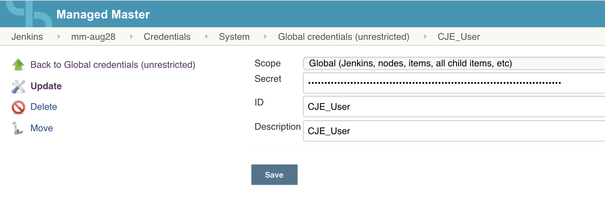
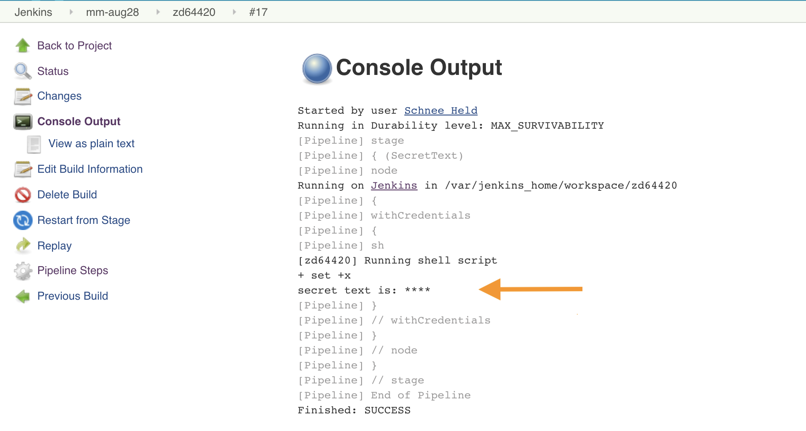
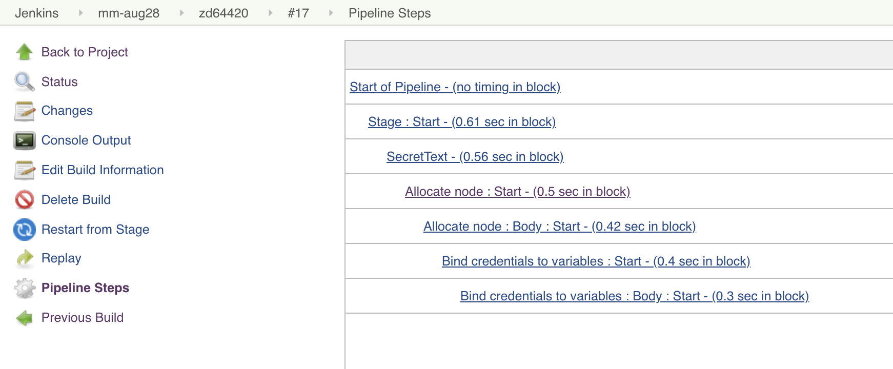

# Issue #

Mask credentials in Build Log issue https://issues.jenkins-ci.org/browse/JENKINS-24805 has been fixed.
Credentials are now masked on the console output of a job log. However, Jenkins credentials are recoverable.


# Environment #

* [CloudBees Jenkins Enterprise](https://release-notes.cloudbees.com/product/91) (CJE)
* [CloudBees Jenkins Enterprise](https://release-notes.cloudbees.com/product/91) - Managed Master (CJEMM)
* [CloudBees Jenkins Enterprise](https://release-notes.cloudbees.com/product/91) - Operations Center (CJEOC)
* [CloudBees Jenkins Platform - Client Master](https://release-notes.cloudbees.com/product/1) (CJPCM)
* [CloudBees Jenkins Platform - Operations Center](https://release-notes.cloudbees.com/product/38) (CJPOC)


# Issue #

Mask credentials in Build Log issue https://issues.jenkins-ci.org/browse/JENKINS-24805 has been fixed.
Credentials are now masked on the console output of a job log. However, Jenkins credentials are recoverable.

A simple `echo $TOKEN > output.log` shows the secret into a text file on the workspace.

It is important to understand that credentials of any type can be recovered by a user having permissions to create a new job or edit an existing job.


## Secret Text Credentials example ##

Consider the following example. We have created credentials of type secret text and we name it `CJE_User`.
The value is masked for any user who updates the credentials, see the screenshot



Create a simple pipeline job with a single step that calls `withCredentials()`. Print the token
into a file, which will be stored in the workspace. 

```
pipeline {
    agent none

    stages {
        stage('SecretText') {
            steps {
                node (label: 'mm-aug28') {
                    withCredentials([string(credentialsId: 'CJE_User', variable: 'TOKEN')]) {
                        sh '''
                        set +x
                        echo "$TOKEN"
                        echo "$TOKEN" > output.log
                        '''
                    }
                }
            }
        }
    }
}
```

Console Output maskes the secret text as expected



From the project **Build history** follow the build hyperlink and open the **Pipeline steps**.



Then follow the **Allocate node : Start** link to get to the workspace. Any user can discover the secret text that is stored unmasked in the `output.log` file.


# References #

[How to manage sensitive credentials?](https://support.cloudbees.com/hc/en-us/articles/115002880172-How-to-manage-sensitive-credentials-)
