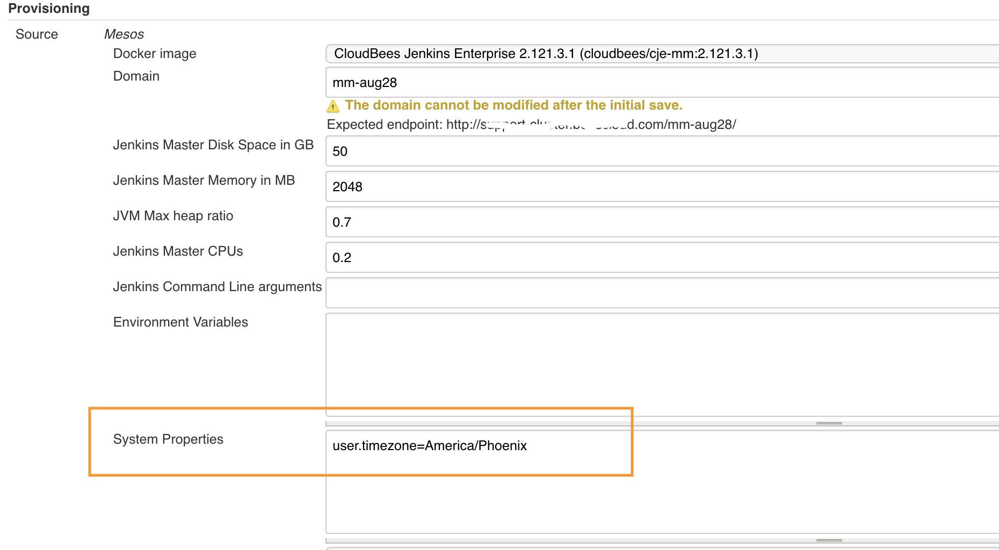
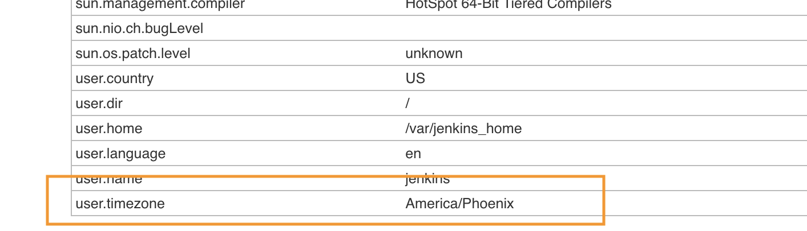

# Change timezone on a CJE Managed Master

We have a CJE environment and I am getting complaints from my customers that their build times are not accurate. My Servers are on the west coast and most of my customers are on the east coast. I am wondering if I can set the time zone per master to be CST, EST, etc. Or what my options are?

## Managed Master timezone

Open the Operation Center and configure the questioned managed master. In the System Properties box add the requested timezone parameter, e.g. `user.timezone=America/Phoenix`. You need to restart the managed master for the change to take effect.

Open **Manage Jenkins > System Information** page and verify the timezone value.

