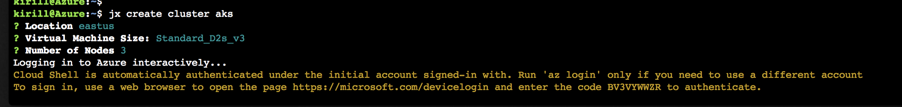
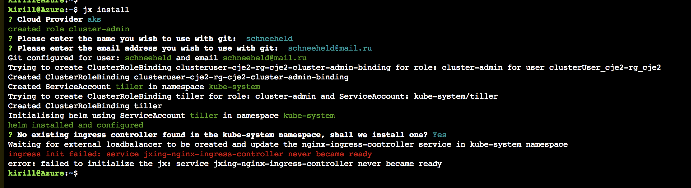

# Jenkins X

Jenkins X is a platform that allows developers shifting from the mode: **_It does not even work in Kubernetes..._**

to the full CI/CD platform where **_A new app runs on Kubernetes_** even before they start coding.


## Tutorial

### Youtube

I started my learning of Jenkins X by reading about it on https://jenkins.io/projects/jenkins-x

- [Get Started](https://jenkins-x.io/getting-started)
- [Create a new cluster](https://jenkins-x.io/getting-started/create-cluster)
- [Install on Kubernetes](https://jenkins-x.io/getting-started/install-on-cluster)

Then I continued watching a presentation by James Strachan (Jenkins X developer)

[Jenkins X: Continuous Delivery for Kubernetes with James Strachan](https://www.youtube.com/watch?v=BF3MhFjvBTU)

[Jenkins X: Easy CI/CD for Kubernetes with Jenkins](https://www.youtube.com/watch?v=iytHDaLb3-Q)
[[Slides]](https://docs.google.com/presentation/d/1gXkshDLU6MI80j1biL3t9NjFwHatkFwJ8qjw6suzclg/edit#slide=id.g3714866e98_1_114)

James is very clear in his suggestion to pick one of the three public cloud providers, and he emphasizes

<p style="text-align: center;"> <b>Do not use mini-kube!</b> </p>

Next demo is about a creating Jenkins X cluster on Google cloud

[jx create cluster on GKE](https://www.youtube.com/watch?v=r8-J9Qg-p9U)


## Azure

Setup kubernetes and install Jenikins X

```
curl -L https://github.com/jenkins-x/jx/releases/download/v1.3.212/jx-darwin-amd64.tar.gz | tar xzv
```

```
jx create cluster aks
```



it takes few minutes to complete the initialization process. My first try, however, is unsuccessful


```
kirill@Azure:~$ jx create cluster aks
? Location eastus
? Virtual Machine Size: Standard_D2s_v3
? Number of Nodes 3
Logging in to Azure interactively...
Cloud Shell is automatically authenticated under the initial account signed-in with. Run 'az login' only if you need to use a different account
To sign in, use a web browser to open the page https://microsoft.com/devicelogin and enter the code BV3VYWWZR to authenticate.

Unexpected polling state code_expired
Error: Command failed  az login
error creating cluster exit status 1
kirill@Azure:~$
```

I already have a 3 nodes kubernetes cluster on Azure

```
Type "az" to use Azure CLI 2.0
Type "help" to learn about Cloud Shell

kirill@Azure:~$ kubectl get nodes
NAME                       STATUS    ROLES     AGE       VERSION
aks-agentpool-16424864-0   Ready     agent     66d       v1.10.3
aks-agentpool-16424864-1   Ready     agent     66d       v1.10.3
aks-agentpool-16424864-2   Ready     agent     66d       v1.10.3
```

so I give Jenkins X one more chance

```
kirill@Azure:~$ jx install
? Cloud Provider aks
created role cluster-admin
? Please enter the name you wish to use with git:  schneeheld
? Please enter the email address you wish to use with git:  schneeheld@mail.ru
Git configured for user: schneeheld and email schneeheld@mail.ru
Trying to create ClusterRoleBinding clusteruser-cje2-rg-cje2-cluster-admin-binding for role: cluster-admin for user clusterUser_cje2-rg_cje2
Created ClusterRoleBinding clusteruser-cje2-rg-cje2-cluster-admin-binding
Created ServiceAccount tiller in namespace kube-system
Trying to create ClusterRoleBinding tiller for role: cluster-admin and ServiceAccount: kube-system/tiller
Created ClusterRoleBinding tiller
Initialising helm using ServiceAccount tiller in namespace kube-system
helm installed and configured
? No existing ingress controller found in the kube-system namespace, shall we install one? Yes
Waiting for external loadbalancer to be created and update the nginx-ingress-controller service in kube-system namespace
```

Few minutes later




Let's troubleshoot

```
kirill@Azure:~$ kubectl get namespaces
NAME            STATUS    AGE
azure-system    Active    66d
default         Active    66d
ingress-nginx   Active    66d
jx              Active    24m
kube-public     Active    66d
kube-system     Active    66d
```

Changing to `jx` namespace, and validating

```
kubectl config set-context $(kubectl config current-context) --namespace=jx
kubectl config view | grep namespace:
```

### Jenkins X Environments

Each team gets their own environment

- Development Tools Environment
 - Jenkins master
 - Elastic pool of Kubernetes build pods
 - Nexus + Monocular (helm application store)
- Staging Environment
- Production Environment


Each team can release apps to the staging environment. Staging namespace is isolated from the production namespace.

## Basic commands

```
jx get env
```

And to see running applications and their versions

```
jx get app
```

When a PR is created, display one or many Preview Environments with

```
jx get priview
```

To look at a Jenkins console

```
jx open jenkins
```

## Devpod Terminal

A devpod is a build node in Jenkins X, that contains software tools for CI/CD.
Actually terminal is running in a pod inside Kubernetes cluster. Devpod is a terminal into a container.

